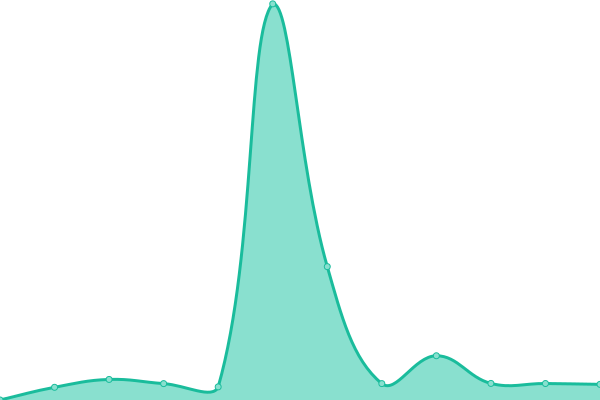

# [📈 Live Status](https://yidasanqian.github.io/uptime): <!--live status--> **🟩 All systems operational**

This repository contains the open-source uptime monitor and status page for [linyu](https://yidasanqian.github.io/), powered by [Upptime](https://github.com/upptime/upptime).

With [Upptime](https://upptime.js.org), you can get your own unlimited and free uptime monitor and status page, powered entirely by a GitHub repository. We use [Issues](https://github.com/yidasanqian/uptime/issues) as incident reports, [Actions](https://github.com/yidasanqian/uptime/actions) as uptime monitors, and [Pages](https://yidasanqian.github.io/uptime) for the status page.

<!--start: status pages-->
<!-- This summary is generated by Upptime (https://github.com/upptime/upptime) -->
<!-- Do not edit this manually, your changes will be overwritten -->
<!-- prettier-ignore -->
| URL | Status | History | Response Time | Uptime |
| --- | ------ | ------- | ------------- | ------ |
|  [Glitch](https://abstracted-wise-garment.glitch.me) | 🟩 Up | [glitch.yml](https://github.com/yidasanqian/uptime/commits/HEAD/history/glitch.yml) | 

 2447ms
     
 | 

<a href="https://yidasanqian.github.io/uptime/history/glitch">90.37%</a>
    

|  [Replit](https://HummingLightgrayMoto.yidasanqian.repl.co) | 🟩 Up | [replit.yml](https://github.com/yidasanqian/uptime/commits/HEAD/history/replit.yml) | 

 3576ms
     
 | 

<a href="https://yidasanqian.github.io/uptime/history/replit">56.54%</a>
    

<!--end: status pages-->

[**Visit our status website →**](https://yidasanqian.github.io/uptime)

## 📄 License

- Powered by: [Upptime](https://github.com/upptime/upptime)
- Code: [MIT](./LICENSE) © [linyu](https://yidasanqian.github.io/)
- Data in the `./history` directory: [Open Database License](https://opendatacommons.org/licenses/odbl/1-0/)
